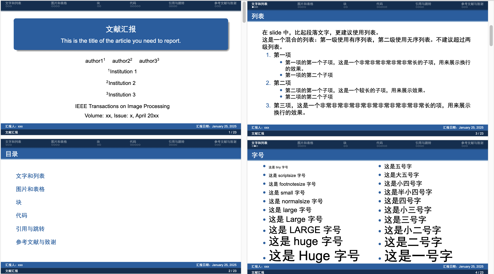
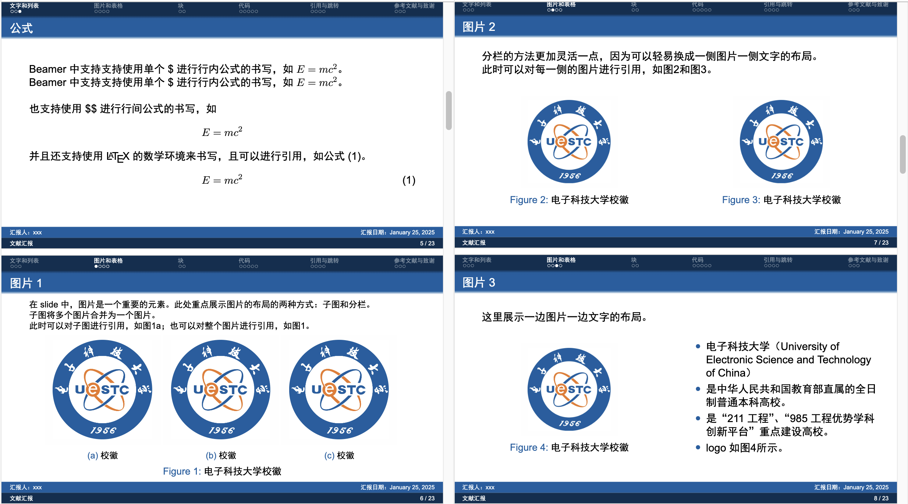
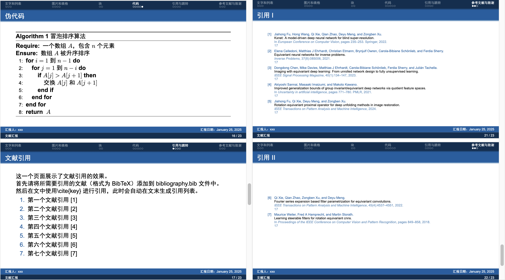

# 电子科技大学 Beamer 模版

这是一个电子科技大学的 Beamer 模版，模版主要参考了[张冬呈的模版](https://www.overleaf.com/latex/templates/uestc-beamer-theme/ybqzdsgvrfdq)。修改后的模版可以帮助我快速制作一份精美的组会汇报 slide.

编译方法：
- 配方：
    - 如果不需要参考文献和公式标注，请使用配方：`xelatex->xelatex`.
    - 如果需要参考文献，请使用配方：`xelatex -> bibtex -> xelatex -> xelatex`.
    - 如果需要公式标注，请使用配方：`xelatex -> xelatex -> xelatex -> xelatex`.
- 更推荐的方法：
    - 使用项目的 makefile 文件来进行编译，使用方法见：`make h`（终端输入，注意此 makefile 仅在 macos 上进行验证）

推荐使用 [Pympress](https://github.com/Cimbali/pympress) 进行演示。

## 模版展示




## 模版使用方法
1. 首先 `git clone https://github.com/Y006/slide_template.git` 克隆仓库到本地，或者点击 Code->Download ZIP 下载压缩包并解压。确保你已经在自己电脑上安装了 xelatex 和 bibtex，或者将压缩包上传到 [Overleaf](https://cn.overleaf.com) 上。
2. 如果在本地，建议使用 VScode 或者你喜欢的编辑器打开整个工程。随后打开文件 `style/titlepage.sty`，更新标题页（title page）的信息。对于组会的文献汇报，建议标题保持“文献汇报”不变，更新子标题为你汇报的文献题目，作者选取文章的前三个作者，并注明作者所在单位，使用 `\inst{number}` 进行作者和所在单位的对应；然后更新出版日期和出版期刊；最后汇报人更新为自己的姓名，汇报日期无需改变，只需要在汇报当日进行一次编译即可。
3. 虽然模版解决了很多潜在的需求，但是为了快速制作一份 slide，应该尽可能寻找文章的 tex 源码（如果存在）。[arXiv](https://arxiv.org) 提供了许多文章的 tex 源码。打开网页搜索你需要的文章，然后在文章界面的右侧可以看到 Access Paper 栏，其中（一般是第三个）可以看到 TeX Source，点击即可下载源码。借助文章的 tex 源码和这个 slide 模版，可以快速组织图片、表格、数学公式和伪代码等内容，并且保持清晰且良好的显示效果。
4. `main.tex` 是制作 slide 主要内容的地方。进入文件，找到注释“你的内容开始的地方”开始制作你的 slide。如果不包含参考文献的更新，可以使用配方 `xelatex->xelatex` 进行编译，如果需要更新参考文献，那么请先将 BibTeX 格式的引用内容粘贴到 `bibliography.bib` 中，然后再使用配方 `xelatex->bibtex->xelatex->xelatex` 进行编译。编译会生成许多中间文件，最终得到的 slide 是文件：`main.pdf`。
5. 最后一步：用你喜欢的 pdf 阅读器打开 `main.pdf`，这里以 VScode 中的LaTeX Workshop Internal PDF Viewer 为例，在阅读器顶部选择“页面滚动”、“单页视图”和“适合页面”。在 Chrome 中，可以直接选择“演示”。

Tips：第一次使用模版时，建议仔细阅读模版介绍、`main.tex` 里的注释和模版编译出的 `main.pdf` 中的内容。

## 模版介绍
本章将会较为详细的讲解如何制作这个 slide，除了模版中“显而易见”的内容，还包含了我设计的一些模版细节，来方便快速实现简单的 latex 学习，力求没有太多 latex 基础的人（事实上本人就是）也可以快速使用 Beamer 来实现快速构建。

### 标题页和目录页
`main.tex` 中的 39 行到 47 行是标题页和目录页。
```tex
% 标题页
\begin{frame}
    \titlepage
\end{frame}

% 目录页
\begin{frame}{目录}
    \tableofcontents[sectionstyle=show]
\end{frame}
```
正如在上文所提到的那样，更新标题页的信息只需要更新文件 `style/titlepage.sty` 中信息，因此 `main.tex` 中无需再关注标题页。而目录页会随着在 `main.tex` 正文中创建 `\section{}` 时自动更新。如果需要修改标题页或者目录页的样式（通常不需要），则需要编辑 `style/UESTC.sty` 中的内容，关于模版样式的内容在此处不再进行更多的阐述。

### 文字和列表

#### 段落

作为一个简洁易用的 slide 模版，应该尽可能将制作者的注意力放在内容创作而非格式调整上。特别是对于组会汇报这种，更应该关注如何讲好自己的内容而非花费太多时间在美观上。因此，一般排版所需要关注的字体问题，在制作 slide 的时候不应该让我们分神。在 Beamer 中似乎字体默认设置为无衬线字体，在 `style/projectfonts.sty` 中设置了英文无衬线字体为 Arial，中文无衬线字体为黑体。可以看到字体的显示效果在模版中表现良好，因此在使用模版制作 slide 时不需要关注字体。

虽然我很希望不需要关注字号问题，特别是事实上 slide 正文中已经默认使用了大小适中的 normalsize 字号。但是在很多场景下：例如列表刚好溢出底部半行，图片的 caption 希望保持原文的内容（可能会非常长）等等。如果是目标是一份精美的 slide 进行演讲，那么可能应该更加慎重的去思索排版上的方法，寻求内容的缩减，但是对于组会汇报的场景，一般 slide 的准则或许要针对性的进行调整，例如一份实验结果的图片，保持文章原文的描述，以便组内进行详细的讨论，甚至粘贴上原文和译文等等。这些情况导致，很多时候改变字号是最方便最有效的选择。因此在模版的第二页我给出了多种字号的选择。

建议：在使用模版时，不要删掉这个页面，保留到最终版再删除，方便随时选取合适的字号并进行调整。另一个值得关注的细节是，在第二页中使用了 `{\tiny 文字内容}` 的形式，但是在后面的一些 frame 中没有用花括号括起来。对于 `\tiny`，将会对这一页 frame 中 `\tiny` 之后的全部内容生效，但是到下一页将会恢复为默认字号。而 `{\tiny 文字内容}` 则会仅对其中的“文字内容”生效。在第二页 frame 中，如果取掉花括号，将会导致无序列表的蓝色圆点跟随字号变大变小，而这是不需要的。

#### 列表

虽然相比于演讲的 slide，组会 slide 会有一些原则发生变化，但是更多的使用列表而非文本仍然是不变的准则。观察第一页 frame 可以注意到，文本文字内容（前三行）并没有进行首行缩进，这并不是很重要的选项，因为建议是将你所需要讲的内容分条列举（甚至将你想讲的文本告诉 ai，那是最擅长分条列举的家伙）并进行阐述。

这里提供了两种列表——无序列表和有序列表，应该是完全够用的。第一页展示了列表的使用方法，包括如何调用两种类型的列表，如何实现多级的效果，这个不再详细阐述，只需要在模版基础上进行修改即可。

#### 公式

Beamer 相比于竞争者 PowerPoint（或许应该说 Beamer 才是挑战者😂），一大优势就在于舒适的数学公式编辑体验。这也是为什么很多数学和物理专业的人偏爱 Beamer。Beamer 中的公式体验非常好，且使用方法非常简单，只需要看一下模版的第三页相信就可以自然的使用。除此之外，从 [arXiv](https://arxiv.org) 中获取文章源码并直接复制是一个好主意（终于不需要OCR识别了，又省了不少时间，好耶！）。

#### Tips

除了模版上本身讲述的内容外，在 `main.tex` 还包含了更多的细节值得注意。

1. 在 Beamer 中，可以使用“源码文字空一行”来实现“编译后文件文本换行”；也可以使用“\\”来实现强制换行。
2. `\vspace{-1.8em}` 实现了垂直方向上的移动。正方向为向下，负方向为向上。 `\vspace{}` 将会是使用本模版排版时最常用的语句之一，因为上下移动组件使用布局工整是 slide 最重要的排版步骤。

    值得注意的是第三页 frame 中使用 `\vspace{\baselineskip}` 实现了空出一行文字的效果，这里的空出一行文字是指空出的一行的行高与上一行文字的高度一致。
3. 分栏：分栏是另一个最常用的语句，它的作用过于明显以至于你只关注它确实是存在的。
    ```tex
    \begin{columns}[t]  % [t] 使内容顶部对齐
        % 左侧列
        \begin{column}{0.5\textwidth}

        \end{column}
        % 右侧列
        \begin{column}{0.5\textwidth}
        
        \end{column}
    \end{columns}
    ```
    上面是一个双栏的代码框架。最值得注意的是 `{0.5\textwidth}`，因为这里的 0.5 和下面的那个 0.5 调整着每一栏的大小，确保他们的和为 1，并且可以多次编译确保能更加合理的确定分栏大小，以便达到最佳显示效果。
4. 放在这里可能不是很合适的选择，但是最后还是要特别说明的是，章节的选择是 `\section{}`，对应的还有 `\subsection{}`（但是仅使用 `\section{}` 足以）。然后一页 slide 也被称为一帧，即 frame：
    ```tex
    \begin{frame}{帧标题}

    \end{frame}
    ```

### 图片和表格

本模版提供了两种排版图片的方式，在实践中作者认为采用这两种方法——子图和分栏已经可以非常好的进行展示。

#### 子图

子图是因为作者注意到在一些（其实观察的样本很少）ieee 文章的 tex 源码中采用了子图的方式，所以才进行了引入（增加了新的 package）。但是后来注意到子图的展示效果非常好，显得更加工整，并且如果同时在一排放置多张图片时也可以很方便的进行排版，因此增加一页专门进行讲解，并放在图片 1 的 frame 中。

在 Beamer 制作的 slide 中，特别是在开组会的情况下，并不需要在意在一行排列很多较小的图片，只要是有需要，把所有实验的对比图放在一页 slide 中供导师和同门参考是应当的。得益于生成的文件是 PDF，放大操作很方便，因此子图提供了很方便的手段进行一组图片的对比。

#### 分栏

分栏是另一种图片展示需求。建议是两种情况：第一种是两个对比的图片讲述的内容不一致，不适合划定在一个图片中，并且应该使用不同的 caption。另一种更适合分栏的情况是一侧图片一侧文字的情况，这种情况下使用分栏会起到工整的排版效果，非常好看。

当然，将子图和分栏结合使用也会起到很好的效果。

#### 表格

或许学术文章中的表格并不是很适合演示用的 slide，但是在组会 slide 上完整展示实验数据来与导师进行讨论并不是一个不好的选择，而且只要获取了文章源码，便可以很方便的创建这样子的表格，这个对于快速做一个组会 slide 也非常有帮助。

对于表格，通常来讲实验结果的表格使用 tiny 字号才能在本模版中实现较好的效果。

### 块和代码

这部分内容，阅读 `main.pdf` 中的内容基本就足够了。值得注意的是，对于包含代码段的 frame，应该使用 `\begin{frame}[fragile]{标题}` 这个格式。

### 引用
在 latex 中可以很方便的引用图片、公式、表格和参考文献。因此在 Beamer 中也不例外。

对于 equation 公式块：
```tex
\begin{equation}
    \label{eq:1}
\end{equation}
```
可以使用 `label{}` 作为标签，并使用 `\eqref{eq:1}` 进行引用。

对于图片和表格，可以使用 `\ref{}` 进行引用

参考文献使用 `\cite{}` 进行引用，关于参考文献的更多细节，请看 `main.pdf` 中的内容。

这里值得注意的小 tips 是，在

```tex
\begin{frame}[allowframebreaks]{引用}
    \tiny\bibliographystyle{unsrt}
    \bibliography{bibliography}
\end{frame}
```

中，可以看到 `[allowframebreaks]` 的修饰，这个正如字面含义所表示的，使用后可以自动根据你输入的内容拆成足够多份 frame 进行展示。但是，只建议在这一个 frame 中使用！！

最后，frame 之间的引用（跳转）也很重要，但是已经在 `main.pdf` 和 `main.tex` 进行了足够清晰的讲解。

### 结束语

如果你仔细阅读完上面的内容，应该已经不难使用这个模版快速做一份精美的组会 slide 了，如果有任何建议或者错误提议，可以提交 Issues，如果帮到你的话希望点一颗星！！后续如果还有时间，会制作一份视频进行讲解（先把大饼画下再说！）

### TODO List

1. 增加对中文字体加粗的支持。
2. 增加更多模版 frame。
3. 解决 block 中多级列表字号不一致问题。
